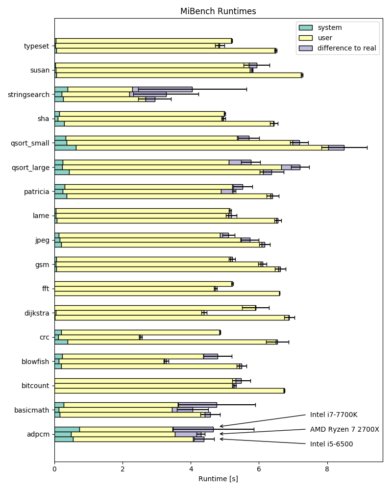

# MiBench
Source Code from: [http://vhosts.eecs.umich.edu/mibench/source.html](http://vhosts.eecs.umich.edu/mibench/source.html)

## Not Ported
 * `consumer/tiff*` Needs system wide installation
 * `office/ghostscript` Not compatible with `stdlib.h`
 * `office/ispell` input file has wrong format 
 * `office/sphinx` Not compatible with `stdlib.h`
 * `security/rijndael` Not compatible with `stdlib.h/stdio.h` 
 * `security/pgp` No compatible system provided by Makefile 
 * `consumer/mad` uses configure
 * `office/rsynth` uses configure

## Build
 * set `PLATFORM`, `CC` and `CFLAGS`
 * run `make`
 * after successful compilation all binaries can be found in `bin`

## Input Generation
### `automotive`
 * `basicmath` number of runs can be adjusted by `export BASICMATH_RUNS=<X>` where as `<X>` is a positive integer (larger `<X>` means longer runtime)
 * `bitcount` input number be adjusted by `export BITCOUNT_INPUT=<X>` where as `<X>` is a positive integer (larger `<X>` means longer runtime)
 * `qsort_small` run `python input_generation/generate_qsort_small_input.py [NUMBER_OF_WORDS]` which generates the file `input_data/qsort_small_input.txt`
 * `qsort_large` run `python input_generation/generate_qsort_large_input.py [NUMBER_OF_VECTORS]` which generates the file `input_data/qsort_large_input.txt`
 * `susan` run `python input_generation/generate_susan_input.py [WIDTH] [HEIGHT]` which generates the file `input_data/susan_input.pgm`

### `consumer`
 * `jpeg` run `python input_generation/generate_jpeg_input.py [WIDTH] [HEIGHT]`  which generates the file `input_data/jpeg_input.ppm`
 * `lame` run `python input_generation/generate_lame_input.py [SECONDS]`  which generates the file `input_data/lame_input.wav`
 * `typeset` run `python input_generation/generate_typeset_input.py [WORDS]`  which generates the file `input_data/typeset_input.lout`

### `network`
 * `dijkstra` run `python input_generation/generate_dijkstra_input.py [NUM_NODES]` which generates the file `input_data/dijkstra_input.dat`
 * `patricia` run `python input_generateion/generate_patricia_input.py [DURATION] [EVENTS]` which generates the file `input_data/patricia_input.udp`

### `office`
 * `stringsearch` number of runs can be adjusted by `export STRINGSEARCH_RUNS=<X>` where as `<X>` is a positive integer (larger `<X>` means longer runtime)

### `security`
 * `blowfish` run `python input_generation/generate_blowfish_input.py [CHARS]` which generates the file `input_data/blowfish_input.asc`
 * `sha` run `python input_generation/generate_sha_input.py [CHARS]` which generates the file `input_data/sha_input.asc`

### `telecomm`
 * `crc` run `python input_generation/generate_crc_input.py [BYTES]` which generates the file `input_data/crc_input.pcm`
 * `fft` input waves ans lengths in `runme_variable.sh` can be adjusted by `export FFT_WAVES=<X>` and `export FFT_LENGTH=<Y>` where as `<X>` and `<Y>` are postive integers (larger `<X>` and `<Y>` mean longer runtime)
 * `adpcm` run `python input_generation/generate_adpcm_input.py [BYTES]` which generates the file `input_data/adpcm_input.pcm`
 * `gsm` run `python input_generation/generate_gsm_input.py [BYTES]` which generates the file `input_data/gsm_input.pcm`
 
## Run
Each benchmark has its own script which is located in `bin`.
```
cd bin
./run_${PLATFORM}
```

## Results
Those results are obtained with the input generation inputs as specified in the [`Makefile`](./Makefile). Both Intel Systems run Scientific Linux 7.6. The AMD System runs Ubuntu 18.04. All benchmarks are executed three times using the `/usr/bin/time` command which measures the `system`, `user`, and `real` time. Each bar of the plot shows the `real` time separated into `system` time, `user` time, and the difference of the sum of `system` and `user` time compared to the `real` time. The error bars show the standard deviation of the `real` time for all three executions.


